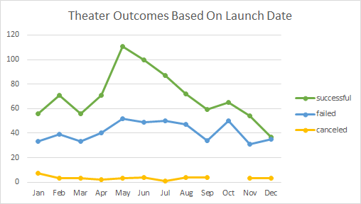
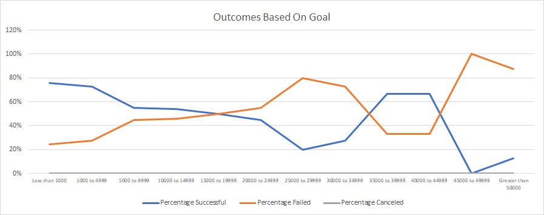

# An Analysis of Kickstarter Campaigns
Performing analysis on Kickstarter data to uncover trends

## Overview of Project

### Purpose
The purpose of this project is to examine trends in Kickstarter campaigns and identify key factors for success. We will specifically look at outcomes based on both fundraiser launch date and fundraising goal. Our analysis will provide insights for individuals planning on launching campaigns to help improve their chances for success.

## Analysis and Challenges

### Analysis of Outcomes Based on Launch Date
We first examined whether there was a correlation between launch date and success rates for campaigns funding theater projects. The raw data was organized into a pivot table filtered to show data for the theater category; the columns showed the outcomes, the rows displayed the months, and the values were the counts of the respective campaigns. The chart below represents the resulting pivot table.

### Analysis of Outcomes Based on Goals
We then examined the relationship between initial campaign goals and success rates for campaigns funding plays within the theater category. We divided the goals into ranges and used conditional summation to determine the counts for successful, failed, and canceled campaigns for plays within each goal range. We then calculated the total number of campaigns in each range to calculate the percentage rate of success, failure, and canceled for each range. The results are illustrated in the following chart.

### Challenges and Difficulties Encountered

The raw data provided all dates in Unix timestamp format, which was not a useful measurement for our charting purposes, so the dates needed to be converted to calendar dates (mm/dd/yyyy) before we could begin analysis. 

## Results

We observed an increase in the number of successful campaigns launched during the months of May, June, and July. Furthermore, the difference between the number of successful campaigns and the number of failed/canceled campaigns is also greatest during this time, meaning that a greater proportion of campaigns launched during these three months were ultimately successful. Conversely, there were fewer successful campaigns launched during the other months, particularly December, and the proportion of successful campaigns launched during these months was lower as well.

We also noticed that campaigns generally have more success when they have modest fundraising goals. When the goal is under 15,000, over 50% of campaigns are successful, while above that it seems to be less predictable. When the goal is reduced further to under 5,000, the success rate jumps to over 70%.

Combining these two observations, our recommendations to optimize the likelihood of success for individuals launching Kickstarter campaigns funding plays, are:
-	Launch in May, or very soon thereafter
-	Set a modest goal under $5000  

There are several limitations to the dataset provided for our analysis. Since it is a global dataset, it might benefit us to perform the same analysis with the data specific to the US. This would affect the launch date analysis due to the seasons being at different times of year. Similarly, the goal ranges don’t account for differences in currency. Unless the data is normalized using exchange rates (or filtered to just USD) not all data points are comparable.

An area for further exploration is determining whether the duration of the campaign affects the likelihood of achieving success.
